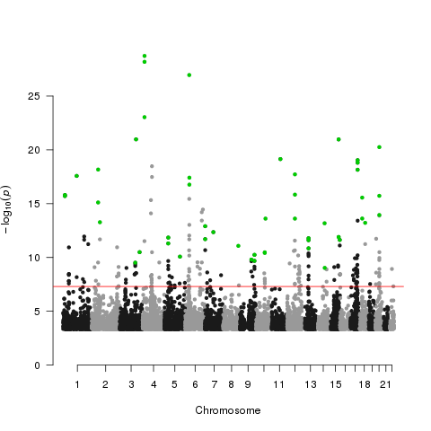

```{r setup, include=F}
library(flexdashboard)
library(data.table)
library(DT)
library(dplyr)
library(readr)
library(ggplot2)
library('GWASTools')
library(qqman)
library(bigsnpr)
```

Column {data-width=650}
-----------------------------------------------------------------------
### Chart A

```{r}
dt<-data.table(Datasets=c("pan_UKBB","Uganda Genome \nProject", "N'diaye et al.", "PAGE", "panUKBB_AFR+UGP+NDIAYE+PAGE_ALL"), Subsets=c("AFR","All from meta-analysis (AFR)","All from meta-analysis (AFR)", "All ancestries", "ALL"), Total_AFR_Size=c(6636,14126,20427,17299, sum(c(6636,14126,20427,17299))), Total_other_Size=c(0,0,0,(49839-17299),(49839-17299))) 
my_table<-datatable(dt,options = list(pageLength = 12))
my_table
```
```{r, echo=FALSE}
#meta_gc<-fread('META_AFR_HEIGHT_hg19.txt.gz')
#meta_gc<-fread('output/test.txt.gz') #test with less lines
#traceback()
#gc()
#setnames(meta_gc, c("P-value", "MarkerName"), c("P", "SNP"))
#gc()
#meta_gc<-meta_gc[,.(P,SNP)]
#gc()
#meta_gc[,c('CHR', 'BP'):=tstrsplit(SNP, "_", fixed=TRUE)]
#gc()
#meta_gc[,CHR:=as.numeric(meta_gc$CHR)]
#gc()
#meta_gc[,BP:=as.numeric(meta_gc$BP)]
#gc()
#meta_gc<-na.omit(meta_gc)
#gc()
#nsnps<-nrow(meta_gc)
#snpsofinterest<-meta_gc[P<=0.00000005]
#n<-nrow(snpsofinterest)
#snpsofinterest<-snpsofinterest[order(CHR, BP)]$SNP
#gc()
#cat(n, ' snps of interest!\n')
#meta_gc[,EXP_P:=seq(1,nsnps)/(nsnps+1)]
#meta_gc<-meta_gc[order(CHR,BP)]
#gc()
#gc()
#cat('Plot\n')
```


### Chart B

```{r chunk4}
#my_plot<-manhattan(meta_gc, highlight=snpsofinterest)
#print(my_plot)

```

Column {data-width=350}
-----------------------------------------------------------------------

### Chart C

```{r}
#my_plot2<-qq(meta_gc$P, main='QQ-plot of P-value')
#print(my_plot2)
```

