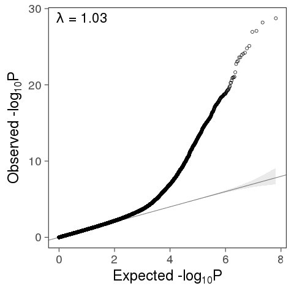

```{r setup, include=F}
library(flexdashboard)
library(data.table)
library(DT)
library(dplyr)
library(readr)
library(ggplot2)
library(captioner)
library('GWASTools')
library(qqman)
library(bigsnpr)
library(kableExtra)
library("wesanderson")
library(rmarkdown)
library(plotly)
library('Cairo')
knitr::opts_chunk$set(cache=TRUE, error=FALSE, fig.cap = " ", message=FALSE, warning=FALSE)
```

# Background

In our previous work, we analysed the factors that drive reduced prediction accuracy of polygenic scores for height in individuals with African ancestry. 

We saw that SFS and LD play a role, but there is also suggestive evidence that differences in marginal effect sizes exist.

In that study we ran a GWAS in ~8,000 individuals with African ancestry from the UKBB and tested for differences in marginal effect sizes between those and European derived effect sizes, as well as correlations of those differences with allelic frequency differences. Finally, we implemented ancestry-informed PRSs in the admixed individuals, and observed only very modest improvement in prediction accuracy.

It is possible that that modest improvement was due to our low sample size. So here we use a much larger sample size (about 58K African ancestry individuals and 91K total) to explore the potential of ancestry-informed PRSs for height. We also try a larger meta-analysis, with 58K African ancestry individuals and 

Another interesting thing is to see whether by fine-mapping index variants by including African ancestry we can select SNPs that yield better PRS performance.

Questions:

1) Does multi-PRS and LA-PRS increase in predictio by using effect-sizes from a meta-African analysis? What about a meta-Pan analysis?

2) What is the overlap between GWAS hits between GWAS for EUR only and BBJ only, AFR only and combinations of those?

3) When we select ancestry-specific index variants and then use those in the PRS, does prediction improve?

4) Other questions?
# Methods

For now, we are focusing on height only.

## GWAS summary statistics
We use GWAS summary statistics for height from six sources::

*UKBB_eur: UK Biobank Europeans

*BBJ: Biobank Japan

*Uganda Genome Project - which is a meta-analysis of Uganda + 3 other populations from Africa, described in the Uganda Genome Project paper); 

* UKBB_afr- from the African subset from the panUKBB dataset.

* N'diaye et al. 2011 - still the largest height GWAS performed in African ancestry individuals; 

* PAGE, a large meta-analysis including 35% African Americans and the remaining participants are mostly of Hispanic/Latino and other minority ancestries.

So our meta-AFR analysis includes: PAGE, Ndiaye, UKBB_afr and 4 cohorts from UGP. 

Our meta-all analysis includes: meta-AFR, UKBB_eur, BBJ.

## Meta-analysis in METAL

We performed two meta-analysis:

*meta-AFR: UGP+pan-UKBB(AFR)+N'Diaye et al. 2011 meta-analysis, PAGE project. Total of 90,970 individuals (58488 of African ancestry). See Table 1.

*meta-ALL: Our meta-ALL analysis includes: UKBB_eur, meta-AFR (previous step), BBJ (Biobank Japan, N=159,095) Total of 610,453 (58488 of African ancestry). See Table 1.

Note that both have the same amount of African ancestry individuals (N=XX). We performed meta-ALL to check whether bigger sample size and increased diversity in the discovery cohort would improve predictions.

We ran a meta-analysis using METAL using one file for each of the above datasets. We set genomic correction to "ON", meaning it is performed for each file (not the final values). We performed the meta-analysis using SCHEME STDERR, meaning betas and SE are used. For the meta-AFR analysis, we set AVERAGEFREQ and MINMAXFREQ to "ON" so that metal can track large allelic frequency differences across datasets as suggestion of allelic mismatch. We only report results for variants that have a combined weight of at least 49,781 (meta-AFR) or 590026 individuals, resulting in about 20 million autosomal variants in both datasets. 

We inspected the p-value distribution of these meta-analyses using QQ-plots and calculated the genomic inflation on the final p-values, and performed corrections accordingly.


## Data QC

## Summary statistics QC

Most were in hg19 build, except N'diaye, which we lift over from hg18 to hg19. Previous filtering was done in each of these studies, and there is often not enough information for us to perform our own filtering.

* UGP: this is very recent. They filtered for imputation score > 0.3.

* pan-UKBB: They filter for INFO scores > 0.8 and minimum allele count of 20 in each population. They also provide a True/False filter for "low_quality_AFR" which we use, retaining only those for which it is 'false'. GWAS included: Age, sex, Age\*sex, Age2, Age2\*sex, the first 10 PCs. Inverse-normal transformation of height in cm.

* N'diaye et al.: The genomic control inflation (GC) factor was calculated for each study and used for within-study correction, prior to the meta-analysis. The overall lambda they report is 1.064 (which we confirm, see table below) suggesting no inflation in this meta-analysis. Imputation info score not available, but authors filtered for >= 0.3. Betas and SE in units of z-score.

PAGE: inverse-normal-adjusted residuals for each trait outcome. Info score available. Filtered for > 0.4 by authors prior. We were more strict and filtered for > 0.8.

As mentioned, for the meta-analyses summary statistics we only retained positions for which there was information for most individuals in the meta-analysis (20.7 and 23.7 M SNPs for meta-AFR and meta-ALL respectively).

For UKBB_eur, we retained only SNPs with INFO> 0.8 (11.9 M SNPs) and low_quality_variant=FALSE (15.4 M SNPs). Only autosomal SNPs were analyzed. 

### LD reference panels

For PRS using summary statistics from the UKBB_eur, we used the UKBB_eur (5,000 randomly sampled) imputed data as LD reference panel.For PRS using the BBJ summary statictics, we used a combination of the 1000G Phase 3 East Asians and UKBB Chinese individuals. For the meta-AFR summary statistics, we used a combination of UKBB_afr and 1000G Phase 3 African ancestry individuals. For the meta-ALL summary statistics, we used a combination of all Phase 3 1000G individuals, the UKBB_eur, UKBB_afr, and UKBB_chi. In all cases, the combined sets were QC'd to only include unrelated individuals (plink --rel-cutoff 0.125) and with genotype missingness < 0.85. We further restricted these sets to SNPs with MAF > 0.001. We further removed SNPs with allelic mismatch with the UKBB_EUR summary statistics file and corrected for strand flipping when appropriate. 

### Test data

For test data, we used the Penn Biobank subsets of European American and African American individuals (Table XX), the HRS subsets of European and African Americans, and the UKBB Chinese individuals (Table XX). We also looked at 33 Japanese Brazilians from the SABE cohort.
Individuals with height further than two deviations from the sex-cohort specific mean were not included. (Table 3)

```{r, echo=F}
dt<-data.table(
        Datasets=c("UKBB_eur","Uganda Genome \nProject", "N'diaye\n et al.", "PAGE", "BBJ", "UKBB_afr"), 
        Ancestries=c("European","African","African, African + European","African, Hispanic, European and others", "Japanese", "African+European"),
        Total=c(360388,14126,20427,49839,159095, 6636),
        Total_AFR=c(0,14126,20427,17299, 0, 6636))
dt[,Total_other=Total-Total_AFR] 
my_table<-datatable(dt,options = list(pageLength = 12), caption="Table 2. Summary statistics used in this study.")
my_table
#knitr::kable(dt, caption="Table 1. Summary statistics used in meta-analyses.")
```


```{r, echo=F}
dt2<-data.table(Datasets=c('meta-AFR', 'meta-ALL'), Lambda:=c(NA,NA),  TotalSampleSize=c(),SampleSizeThresh=c(49781,590026), N_pos_QC=c(20777174, 2370628))
my_table2<-datatable(dt2,options = list(pageLength = 12), caption="Table 1. Meta-analyses")
my_table2
#knitr::kable(dt, caption="Table 1. Summary statistics used in meta-analyses.")
```

```{r, echo=F}
dt3<-data.table(Set=c('ALL', 'AFR', 'EAS', 'EUR'), Sources=c("1KGP3'+UKBB_eur+UKBB_afr+UKBB_chi", "1KGP3_afr+UKBB_afr", "1KGP3_eas+UKBB_chi", "UKBB_eur"), N_indiv_QC=c(5974,4521,1936,4994), N_snps_QC=c(1439609,1651938,1559474,1920308))
my_table3<-datatable(dt3,options = list(pageLength = 12), caption="Table 3. LD reference panels post quality control")
my_table3
#knitr::kable(dt, caption="Table 1. Summary statistics used in meta-analyses.")
```

```{r, echo=F}
dt4<-data.table(Dataset=c('UKBB_chi', 'PMBB_afr', 'HRS_afr', 'PMBB_eur', 'HRS_eur'), N_indiv_QC=c(1467,8726,2251,6709,10159), N_snps_QC=c(784027,602645,2183141, 610494,2183141))
my_table4<-datatable(dt4,options = list(pageLength = 12), caption="Table 4. Test data post quality control")
my_table4
#knitr::kable(dt, caption="Table 1. Summary statistics used in meta-analyses.")
```


```{r, out.width = "360px",echo=FALSE, eval=T, fig.cap="Fig 1: QQ-plot for meta-AFR. P-values were GC corrected within each dataset, but not the final meta-AFR analysis. Based on the lambda value show here, downstream analyses referred to corrected final p-values."}

```


```{r, out.width = "760px",echo=FALSE, eval=T, fig.cap="Fig 2: Manhattan plot for meta-AFR GWAS (top) and UKBB_EUR (bottom, for comparison). Genome-wide significance line is plotted at P=1e-08. SNPs above that threshold are plotted in red (49 and 3,308  SNPs for meta-AFR and UKBB_Eur, respectively). SNPs above threshold in both meta-AFR and UKBB_eur GWAS are plotted in orange (8 SNPs). SNPs were clumped prior to plotting (P<=5e-04, 100Kb window)."}
knitr::include_graphics("qqman_ggplot_comparison.png")
```


## Test cohorts

 Genotype data from test cohorts was lifted over to hg38 when needed. 

* PMBB (Penn Biobank): with sets of EUR (7501) and AFR ancestry individuals (9226)

* UKB_CHI (UKBB Chinese): a set of 1,504 individuals with Chinese ancestry from the UK Biobank.

* HRS (Health and Retirement Study): with sets of EUR (10,486) and AFR (2,322) ancestry individuals.

We visually inspected qq-plots of height residuals for each dataset to check for extreme outliers. Based on this inspection, we restricted PMBB (Figs 3-4 for before and after filtering) and HRS (Figs 5-6 for before and after filtering) samples to those for which residual height was between $\pm3$ standard deviations from the mean for each sex. For UKB-CHI, no filtering was necessary (Fig 7). Height residuals were obtained by regressing height on all co-variates and their interactions for each individual:

$$height\sim Sex+Age+Age^2+Sex*Age+Sex*Age^2+pEUR+Sex*pEUR+Age*pEUR+Age^2*pEUR$$ 

, where $p_{EUR}$ is the genome-wide average proportion of European ancestry for PMBB_afr and HRS_afr (estimated through RFMIx), and the European ancestry component (estimated through unsupervised ADMIXTURE with k=2) for UKB_CHI. For HRS_eur and PMBB_eur, we set $p_{EUR}$ to 1. 

When multiple time points were available for each individual, we retained the one corresponding to the latest height measure and age. All height phenotype data was formatted to be in centimeters. 

Each test cohort was randomly divided into a "train" and a "test" set following the ratio of 0.15 (train) and 0.85 (test) for most datasets, except for UKB_CHI and HRS_afr, where we used 0.20:0.80 (Table 2). We performed a stratified split of the data using the initial_split function from the rsample R package. We used 'Sex' as strate, i.e, to maintain Sex proportions within training and testing sets similar (Table 2)


```{r, echo=F,out.width = "460px"}
dt2<-data.table(Dataset=c('PMBB', 'PMBB', 'HRS','HRS', 'UKBB'), Subset=c('AFR', 'EUR','AFR', 'EUR','CHI'), Mean_pEUR=c(19.9,1,17.5,1,NA), N_total=c(8808,6775,1596,7233,1496),Females=c(63.3,39.6,62.7,57.4,62.5),N_train=c(6166,4744,682,3099,226), N_test=c(2642,2031,1822,8781,1270))
#knitr::kable(dt2, caption="Table 2. Test cohorts")
my_table2<-datatable(dt2,options = list(pageLength = 12), caption="Table 2. Test cohorts")
my_table2
```


### PRS calculations

We used LDpred for PRS calculations. For UKBB_eur summary statistics, we used the UKBB_eur as LD reference panel; for BBJ and meta-AFR we used East Asians and Africans from 1000G Phase 3, respectively. We first ran ldpred coord to coordinate the summary statistics, test and LD datasets. Next we ran the gibbs sampler. Many values of p did not covnerge, but typically p=1 and p=0.3 did converge, so we looked at those, as well as the infinitesimal model. See Table 

PRS_eur: PRS using effect sizes ($\beta$) from UKBB_eur. 

PRS_eas: PRS using effect sizes ($\beta$) from BBJ (all East Asian).

PRS_afr: PRS using effect sizes (($\beta$) from the meta-AFR GWAS.

PRS_all: PRS using effect sizes (($\beta$) from the meta-ALL GWAS.

1) A simple linear regression model


$$height~Sex+Age+Age2+pEUR$$ 

$$height~Sex+Age+Age2+pEUR+PRS_{eur}$$ 


2) PRS1_ML (described in Marquez-Luna et al. 2017 and Bitarello & Mathieson 2020)

3) PRS2_BD - linear combination of PRS described in Bitarello & Mathieson 2020

```{r, echo=F, chunk='ldpred_table'}
dt=fread('ldpred_table.txt')
dt[,AIC:=round(AIC,1)]
my_table3<-datatable(dt,options = list(pageLength = 12),caption="Table 3. LDpred models")
#knitr::kable(dt)
my_table3
```

```{r, chunk='R2_table', out.height = "460px",out.width="660px",echo=FALSE, eval=T, fig.cap="Fig 3: Partial-R2 for height PRS for different test cohorts and using different summary statistics and LDpred models "}
dt=fread('ldpred_table.txt')[LDpred_model=='Inf']
dt[,AIC:=round(AIC,1)]
dt[,Train:=gsub('_train','', dt$Test)]
dt$Train<-factor(dt$Train)
data_long <- gather(dt, variable, value, -c(Train, Summary_Stats,LDpred_model,Test))
#dt2<-melt(dt, by=c('R2','AIC'))
p2<-ggplot(dt, aes(x=Train, y=R2,color=Summary_Stats)) +
geom_jitter(size=3, alpha=0.7, width=0.2) + 
#facet_wrap(~variable, nrow=2, scales='free')  +     
scale_color_manual(name='',values = wes_palette("Moonrise3",3), labels=c('BBJ_eas','meta-AFR','UKBB_eur')) + 
#scale_shape_manual(name = "LDpred Model", labels = c("Infinitesimal", "p=1", "p=0.3")) +
theme_bw()+ labs(title="")
ggplotly(p2)

```


```{r, chunk='PRS1_2_figure',out.height = "760px",out.width="560px",echo=FALSE, eval=T, fig.cap="Fig 4: Linear combinations of PRS for PMBB_afr. PRS1_ML, described in Marquez-Luna et al. 2017 and Bitarello & Mathieson 2020. PRS2_BM, described in Bitarello & Mathieson 2020. Fold increase relative to alpha=0. Anc2 is the ancestry of the second PRS component."}
dt3=fread('PRS1_2_table.txt')
for (I in c('pmbb_afr', 'hrs_afr', 'chi')){
my_plot<-paste0(paste0('plot_', I),c('_1', '_2')) 
dt2<-dt3[Train==I]
dt2$Model<-factor(dt2$Model)
dt2[,Base_Rsq:=ifelse(Model=='LDpred-Inf',
max(dt2[Model=='LDpred-Inf' & Alpha==0.00]$R_sq),
ifelse(Model=='LDpred-p1', 
max(dt2[Model=='LDpred-p1' & Alpha==0.00]$R_sq), max(dt2[Model=='LDpred-p03' & Alpha==0.00]$R_sq)))]
dt2[,R_sq_fold:=R_sq/Base_Rsq]
p1<-ggplot(dt2, aes(x=Alpha, y=R_sq,color=Test)) +
geom_line(size=0.9,) + 
facet_grid(scales='free', vars(Model), vars(Anc2))  +     
scale_color_manual(name='',values = wes_palette("GrandBudapest2",2)) + 
theme_bw()+ labs(title="")
p2<-ggplot(dt2, aes(x=Alpha, y=R_sq_fold,color=Test)) +
geom_line(size=0.9,) + 
geom_hline(yintercept=1, col='darkgray',lty=2)+        
facet_grid(scales='free', vars(Model), vars(Anc2))  +     
scale_color_manual(name='',values = wes_palette("GrandBudapest2",2)) + 
theme_bw()+ labs(title="")
assign(my_plot[1],p1)
assign(my_plot[2],p2)
cat(paste0('the winner for ', I,' is:\n'))
print(dt2[which.max(dt2$R_sq),])
}
ggplotly(plot_pmbb_afr_2)
```


```{r, chunk='PRS1_2_figure5',out.height = "760px",out.width="560px",echo=FALSE, eval=T, fig.cap="Fig 5: Linear combinations of PRS for PMBB_afr. PRS1_ML, described in Marquez-Luna et al. 2017 and Bitarello & Mathieson 2020. PRS2_BM, described in Bitarello & Mathieson 2020. Absolute values. Anc2 is the ancestry of the second PRS component."}

ggplotly(plot_pmbb_afr_1)
```


```{r, chunk='PRS1_2_figure6',out.height = "760px",out.width="560px",echo=FALSE, eval=T, fig.cap="Fig 6: Linear combinations of PRS for HRS_afr. PRS1_ML, described in Marquez-Luna et al. 2017 and Bitarello & Mathieson 2020. PRS2_BM, described in Bitarello & Mathieson 2020. Fold increase relative to alfa=0. Anc2 is the ancestry of the second PRS component."}
ggplotly(plot_hrs_afr_2)
```


```{r,out.height = "760px",out.width="560px",echo=FALSE, eval=T, fig.cap="Fig 7: Linear combinations of PRS for HRS_afr. PRS1_ML, described in Marquez-Luna et al. 2017 and Bitarello & Mathieson 2020. PRS2_BM, described in Bitarello & Mathieson 2020. Absolute values. Anc2 is the ancestry of the second PRS component."}
ggplotly(plot_hrs_afr_1)
```


```{r, chunk='PRS1_2_figure8', out.height = "760px",out.width="560px",echo=FALSE, eval=T, fig.cap="Fig 8: Linear combinations of PRS for UKB_CHI. PRS1_ML, described in Marquez-Luna et al. 2017 and Bitarello & Mathieson 2020. PRS2_BM, described in Bitarello & Mathieson 2020. Fold increase relative to alpha=0. Anc2 is the ancestry of the second PRS component."}
ggplotly(plot_chi_2)
```


```{r, chunk='PRS1_2_figure9',out.height = "760px",out.width="560px",echo=FALSE, eval=T, fig.cap="Fig 9: Linear combinations of PRS for UKB_CHI. PRS1_ML, described in Marquez-Luna et al. 2017 and Bitarello & Mathieson 2020. PRS2_BM, described in Bitarello & Mathieson 2020. Absolute values. Anc2 is the ancestry of the second PRS component."}
ggplotly(plot_chi_1)
```

## PRS1 and PRS2 discussion:

Conclusions:

Optimized tuning occurs for $\alpha=0.695$ for both PRS1 and PRS2 using 'AFR' as the second ancestry.

For PRS1_ML: Under these parameters, we see a 1.62 and 1.65 fold increase from PRS_eur and PRS_afr respectively.

For PRS1_ML: Under these parameters, we see a 1.65 and 1.15 fold increase from PRS_eur and PRS_afr respectively.

[ongoing...]