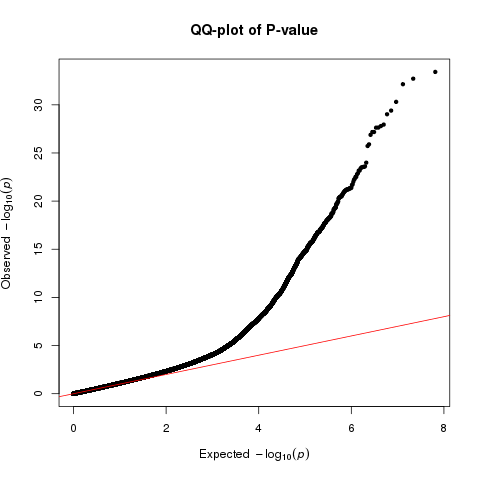
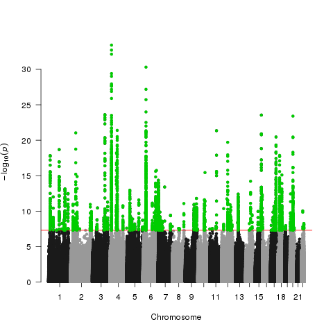
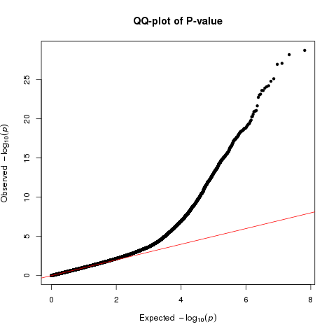

```{r setup, include=F}
library(flexdashboard)
library(data.table)
library(DT)
library(dplyr)
library(readr)
library(ggplot2)
library('GWASTools')
library(qqman)
library(bigsnpr)
library(kableExtra)
library("wesanderson")
library(rmarkdown)
library(plotly)
library('Cairo')
#library(knitr)
```

# Background

In our previous work, we analysed the factors that drive reduced prediction accuracy of polygenic scores for height in individuals with African ancestry. 

We saw that SFS and LD play a role, but there is also suggestive evidence that differences in marginal effect sizes exist.

In that study we ran a GWAS in ~8,000 individuals with African ancestry from the UKBB and tested for differences in marginal effect sizes between those and European derived effect sizes, as well as correlations of those differences with allelic frequency differences. Finally, we implemented ancestry-informed PRSs in the admixed individuals, and observed only very modest improvement in prediction accuracy.

It is possible that that modest improvement was due to our low sample size. So here we use a much larger sample size (about 58K African ancestry individuals and 91K total) to explore the potential of ancestry-informed PRSs for height.

# Meta-analysis data information

## GWAS summary statistics
We use GWAS summary statistics for height from four sources: Uganda Genome Project (which is a meta-analysis of Uganda + 3 other populations from Africa); pan UKBB (AFR), this is a height GWAS done for each subpopulation in the UK Biobank separately; N'diaye et al. 2011, still the largest height GWAS performed in African ancestry individuals; PAGE, a large meta-analysis including 35% African Americans and the rest Hispanic/Latino and other minority ancestries.

Most were in hg19, except N'diaye, which we lift over to hg19 from hg18. Previous filtering was done in each of these studies, and there is often not enough information for us to perform our own filtering.

UGP: this is very recent. They filtered for imputation score > 0.3.

panUKBB: They filter for INFO scores > 0.8 and minimum allele count of 20 in each population. They also provide a True/False filter for "low_quality_AFR" which we use, retaining only those for which it is 'false'. GWAS included: Age, sex, Age\*sex, Age2, age2\*sex, the first 10 PCs. Inverse-normal transformation of height in cm.

N'diaye et al.: The genomic control inflation (GC) factor was calculated for each study and used for within-study correction, prior to the meta-analysis. THe overall lambda they report is 1.064 (which we confirm, see table below) suggesting no inflation in this meta-analysis. Imputation info score not available. Authors Filtered for >= 0.3. Betas and SE in units of z-score.

PAGE: inverse-normal-adjusted residuals for each trait outcome. Info score available. Filtered for > 0.4 by authors prior. We were more strict and filtered for > 0.8.

```{r, echo=F}
dt<-data.table(Datasets=c("pan_UKBB","Uganda Genome \nProject", "N'diaye et al.", "PAGE", "ALL"), Subsets=c("AFR","All from meta-analysis (AFR)","All from meta-analysis (AFR)", "All ancestries", "ALL"), Total_AFR=c(6636,14126,20427,17299, sum(c(6636,14126,20427,17299))), Total_other=c(0,0,0,(49839-17299),(49839-17299)))[,Grant_total:=Total_AFR+Total_other][, Lambda:=c(1.037,"0.823*",1.065,1.183, NA)]
my_table<-datatable(dt,options = list(pageLength = 12))
my_table
#knitr::kable(dt)
```


## Meta-analysis

We ran a meta-analysis using METAL using one file for each of the above datasets. We set genomic correction to "ON", meaning it is performed for each file (not the final values). We perform the meta-analysis using SCHEME STDERR, meaning betas and SE are used. We set AVERAGEFREQ and MINMAXFREQ to "ON" so that metal can track large allelic frequency differences across datasets as suggestion of allelic mismatch. We only report results for variants that have a combined weight of at least 45000 individuals, resulting in about 32.5 million autosomal variants.

## QQ plot from META-analysis (no correction)



## Manhattan plot of META-analysis (no correction)



## QQ plot from META-analysis (GC corrected)



## Manhattan plot of META-analysis (GC corrected)


## PRS for Height

```{r, echo=F}
dt=do.call(rbind, lapply(list.files(pattern="*.csv"), function(X) fread(X, sep=",", header=T)))[Phenotype=='Height']
my_table<-datatable(dt,options = list(pageLength = 12))
#knitr::kable(dt)
my_table
```

```{r, echo=F}
dt2<-dt[Method=='LDpred-Inf'][Phenotype=='Height']
#dt2$Phenotype<-factor(dt2$Phenotype, levels=c('Height', 'BMI'))
my_plot2<-ggplot(dt2, aes(x=`Main Test Cohort Ancestry`,y=`Variance Explained (%)`, colour=`Discovery Cohort`)) +
#        facet_wrap(~Phenotype, dir='v') + 
        geom_point(size=3) + 
        scale_color_manual(values = wes_palette("Darjeeling2")) + 
        theme_bw()+
        labs(title="Height")
p<-ggplotly(my_plot2,tooltip="text")
p
```