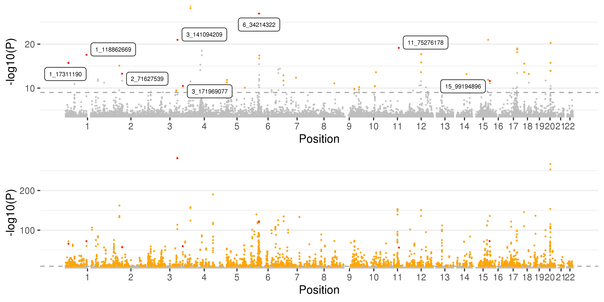

```{r setup, include=FALSE}
options(htmltools.dir.version = FALSE)
library(data.table)
library(wesanderson)
library(rmarkdown)
library(Cairo)
library(kableExtra)
```

```{r xaringan-themer, include=FALSE, warning=FALSE}
library(xaringanthemer)
style_duo_accent(
  primary_color = "#1381B0",
  secondary_color = "#FF961C",
  inverse_header_color = "#FFFFFF",
  colors = c(
  pink = "#E6A0C4",
  cornflowerblue = "#7294D4",
  weirdbrown = "#D8A499",
  lilac="#C6CDF7",
  gray="#8D8680",
  green="#78B7C5",
  orange="#F2AD00"
)
)
```
---
class:top,left
##A brief recap on: 


.center[### .weirdbrown["What explains the loss of accuracy (LOA) of polygenic score predictions for height in individuals with African ancestry when compared to Europeans?"]]

### 

---
class: top, left

##From our paper

* between 73-77% LOA for AFR compared to EUR

* SFS: between 0-20% of LOA

* LD: some effect but not really quantifiable in our approach

* Imputation made no real difference

* We find evidence that differences in marginal effect contribute to LOA:

  * effect sizes differ between AFR and EUR ancestries 
  * effect directions differ (unweighted PRS shows same pattern)
  * mild positive correlation between diff in effect sizes and diff in allelic frequencies
  * Ancestry-informed PRS gave minor gain in accuracy
  
---
class: top, left
##Open questions

1. Can we fully or near fully explain LOA in AFR compared to EUR by using ancestry-informed PRS?

  .weirdbrown[**Yes?**] Great. Find new project
  
  .weirdbrown[**No?**] then:

2. What explains the missing LOA?

  Our paper showed some preliminary evidence of differences in marginal effect sizes
  
  a) the models in Wang & Visscher (2020) assume $r_g=1$, which we know is not true. What's the prediction LOA from their models under reasonable assumptions and does real data agree with it?
  
  b) Veturi (2019) proposed a model that allows for regional genomic differences in $r_g$. How well does data match those predictions?
  
  c) Can we use Veturi model and ancestry to inform PRS and thus account fully for LOA?
  
  
---
class: top, left

####  a) the models in Wang & Visscher (2020) assume $r_g=1$, which we know is not true. What's the prediction LOA from their models under reasonable assumptions and does real data agree with it?

--

* `Eq. 2`: heuristic method for candidate causal variants **(pred2)**
  * 100Kb windows, $r2>0.45$ with GWS SNPs
* Once candidate causal variants are identified for each GWS SNP, replace $r^{2}_{jk,1}$ and $r_{jk,1}r_{jk,2}$ with the average over all causal variants

$$RA_{pred2}\approx \left[ \frac{\rho_{b}^{2} h^{2}_{2}}{h^{2}_{1}} \right] X \left( \frac{\sum_{k=1}^{M_{T}}\overline{r_{k,1}r_{k,2}}\sqrt{\frac{p_{k,2}(1-p_{k,2})}{p_{k,1}(1-p_{k,1})}}}{\sum_{k=1}^{M_{T}}\overline{r^{2}_{k,1}}}\right) X \left[ \frac{\sum_{k=1}^{M_{T}}p_{k,1}(1-p_{k,1})\hat{\beta}^{2}_{k}}{\sum_{k=1}^{M_{T}}p_{k,2}(1-p_{k,2})\hat{\beta}^{2}_{k}}\right]$$

--
###Hipothesis: $RA_{pred2}$ prediction explains real LOA
---
####How to test?

 * .weirdbrown[height] because of data availability and high heritability
 
* large sample .weirdbrown[GWAS for African ancestry] and EAS and EUR

* independent data sets to test on

* get $r_g$ between EUR-AFR, EUR-EAS

* use equation to get predicitons, compare to real data observations
  
Data:

* .weirdbrown[Summary statistics] for height: BBJ (EAS), UKBB_eur, META-ANALYSIS for AFR

* .weirdbrown[Test data:] UKB_Chinese, PMBB_AFR, PMBB_EUR, HRS_AFR, HRS_EUR

* equations from Wang & Visscher

---
#### b) Veturi (2019) proposed a model that allows for regional genomic differences in $r_g$. How well does data match those predictions?

* $r_g$ for height: 48-71% depending on SNP P-value cutoff

* What about East Asians? Wang & Visscher suggest LD and MAF explain a lower proportion of LOA
  
* Use Veturi model  - Bayesian Generalized Linear Regression (BGLR) (R package), need to figure out details

###Hipothesis: portion of LOA not explained by Wang & Visscher model is due to fine-scale allelic heterogeneity or population-specif epistasis

---
####How to test?

* PRS that combined LAI and local $r_g$ 

* Ideas?


---
class: middle, center, inverse
##Some results


---
###META-analysis for height in African ancestry individuals

```{r, echo=F}
dt<-data.table(Datasets=c("pan_UKBB","Uganda Genome \nProject", "N'diaye et al.", "PAGE", "ALL"), Subsets=c("AFR","All from meta-analysis (AFR)","All from meta-analysis (AFR)", "All ancestries", "ALL"), Total_AFR=c(6636,14126,20427,17299, sum(c(6636,14126,20427,17299))), Total_other=c(0,0,0,(49839-17299),(49839-17299)))[,Grant_total:=Total_AFR+Total_other][, Lambda:=c(1.037,1.018,1.065,1.183, 1.026)]
#my_table<-datatable(dt,options = list(pageLength = 12))
#my_table
knitr::kable(dt)
```

---
###META-analysis for height in African ancestry individuals
```{r, out.width = "460px",echo=FALSE, eval=T}
knitr::include_graphics("qq_plot.png")
```

---
###META-analysis for height in African ancestry individuals

```{r, echo=F}

dt=do.call(rbind, lapply(list.files(pattern="*.csv"), function(X) fread(X, sep=",", header=T)))
knitr::kable(dt)
```


---
###META-analysis for height in African ancestry individuals

```{r, out.width = "460px",echo=FALSE, eval=T}
dt2<-dt[Method=='LDpred-Inf'][Phenotype=='Height']
#dt2$Phenotype<-factor(dt2$Phenotype, levels=c('Height', 'BMI'))
my_plot2<-ggplot(dt2, aes(x=`Main Test Cohort Ancestry`,y=`Variance Explained (%)`, colour=`Discovery Cohort`,shape=`Test set`)) + 
       #facet_wrap(~Phenotype, dir='h') + 
        geom_point(size=3) + 
        scale_color_manual(values = wes_palette("Darjeeling2")) + 
        theme_bw()+
        labs(title="")
p<-ggplotly(my_plot2,tooltip="text")
p
```

---
###META-analysis for height in African ancestry individuals


```{r, out.width = "8in", out.height="4in",echo=FALSE, eval=T, fig.cap="A captiotion"}
#
p<-readRDS('meta_man.Rds')
names(p)<-c('afr', 'eur')
fig <- ggplotly(p$afr, tooltip='text')
fig <- style(fig, line = list(color = 'gold'), hoverinfo = "y", traces = 1)
fig
```